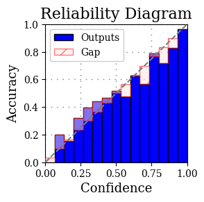

## Model Calibration

### Introduction
This repository contains code for calibrating Hugging Face models on a given dataset. The calibration process involves calculating metrics such as expected calibration error and static calibration error, as well as plotting confidence histograms and reliability diagrams.

### Requirements
To run the code in this repository, you need to have the following dependencies installed:
- Hugging Face `transformers` library
- Python 3.x
- Matplotlib
- NumPy
- WandB (optional, for logging)
- Others

### Usage
1. **Clone the Repository:**
   ```
   git clone https://github.com/ps4vs/HF-Model-Calibration.git
   cd HF-Model-Calibration
   ```

2. **Create and Activate Virtual Environment:**
   ```
   python -m venv venv
   source venv/bin/activate
   ```

3. **Install Dependencies:**
   ```
   pip install -r requirements.txt
   ```

4. **Run the Script:**
   ```
   python calibrate_model.py
   or 
   python calibrate_model.py --models <model_1_name> <model_2_name> --dataset <dataset_name> --split <split_name> --num_images <num>[--wandb] [--save]
   ```

### Arguments
- `--models`: Specify one or more Hugging Face model checkpoint locations. You can provide a list of model strings separated by spaces. If not provided, the default model checkpoint location is 'google/vit-base-patch16-224' 

    Example usage: `--models model1 model2 model3`

    The specified models will be evaluated, and the calibration metrics will be calculated for each model separately.

- `--dataset`: Specify the Hugging Face dataset location (default: 'imagenet-1k').
- `--split`: Specify which dataset split to load (default: 'validation').
- `--wandb`: Flag to enable logging with WandB (optional).
- `--save`: Flag to save the generated plots and calibration metrics (optional). 
            Results will be saved to `./{model}_{dataset}/`
- `--num_image`: Specify number of images to be considered for calibration (default: 2000).

### Output
After running the script, you will get the following outputs:
- Expected calibration error (ECE)
- Static calibration error
- Confidence histogram plot
- Reliability diagram plot

### Results of ConvNext on 2000 images from Imagenet1K


### Results of ViT on 2000 images from Imagenet1K




### Contributors
- sivav [subhashpadala18@gmail.com]